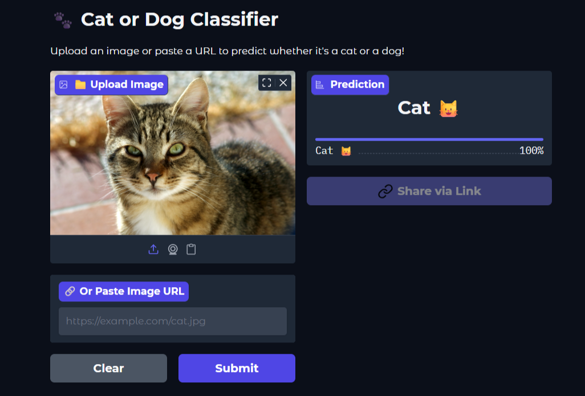

# 🐾 Cat or Dog Classifier

A Deep Learning CNN model that classifies images as **cats** or **dogs** with high accuracy.

## 🚀 Live Demo
👉 [Try it on Hugging Face Spaces](https://huggingface.co/spaces/Joydeip/cat-dog-classifier)

## 📸 App Preview


## 🧠 Model Architecture
```
Input (256x256x3)
    ↓
Conv2D (32 filters) + MaxPool2D
    ↓
Conv2D (64 filters) + MaxPool2D
    ↓
Conv2D (128 filters) + MaxPool2D
    ↓
Flatten
    ↓
Dense (128) → Dense (64) → Dense (1, sigmoid)
    ↓
Output: Cat 🐱 or Dog 🐶
```

## 📊 Dataset
- Source: [Kaggle - Dog vs Cat Images](https://www.kaggle.com/datasets/kunalgupta2616/dog-vs-cat-images-data)
- Training images: **25,000**
- Validation images: **8,000**
- Classes: Cat / Dog

## 🛠️ Built With
- Python
- TensorFlow / Keras
- Gradio
- Google Colab (training)
- Hugging Face Spaces (deployment)

## 📁 Project Structure
```
cat-dog-classifier/
├── app.py                        ← Gradio web app
├── cat-dog-classify.ipynb        ← Training notebook
├── requirements.txt              ← dependencies
├── sample_cat.jpg                ← sample cat image
├── sample_dog.jpg                ← sample dog image
└── my_cnn_model(cat-dog).h5     ← trained model (Git LFS)
```

## ⚙️ Run Locally
```bash
git clone https://github.com/Joydeip/cat-dog-classifier
cd cat-dog-classifier
pip install -r requirements.txt
python app.py
```

## 🏋️ Train the Model
Open `cat-dog-classify.ipynb` in Google Colab:
1. Upload your `kaggle.json` API key
2. Run all cells
3. Model saves as `my_cnn_model.h5`

## 👨‍💻 Author
**Joydip Paul**
- Hugging Face: [Joydeip](https://huggingface.co/Joydeip)
- GitHub: [YOUR_GITHUB_USERNAME](https://github.com/Joydeip)
